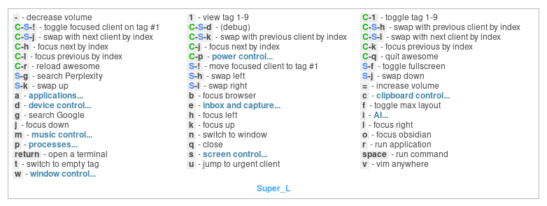
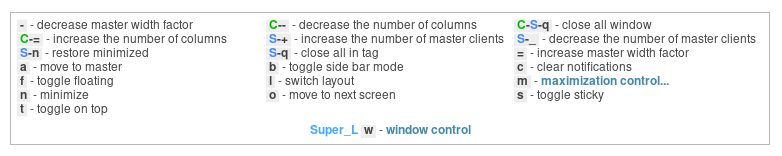
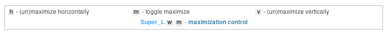

# awesome-wm-hydra
Multi-key-sequence framework for AwesomeWM with key hints display. It allows you to bind action to a sequence of any number of keys, such as `Super` + `w` + `c`. The sequence resets only when the initial `Super` is released, allowing you to easily implement modal bindings, such as pressing `Super` + `m` for music-related keys then press `h`/`l` multiple-times for seeking while holding down `Super`.





## Getting started

- Clone this repository to your AwesomeWM configuration directory:
    ```sh
    git clone https://github.com/TommyX12/awesome-wm-hydra.git ~/.config/awesome/awesome-wm-hydra
    ```
- Require the module in your `rc.lua`:
    ```lua
    local hydra = require("awesome-wm-hydra")
    ```
- Write hydra key binding configs somewhere in your setup. Example (describe bindings that are active after pressing left super key):
    ```lua
    local super_key_bindings = {
        ["return"] = {"open a terminal", function() awful.spawn(terminal) end},
        ["control-r"] = {"reload awesome", awesome.restart},
        ["j"] = {"focus down", function()
            awful.client.focus.bydirection("down")
            if client.focus then client.focus:raise() end
        end},
        ["r"] = {"run application", function()
            awful.spawn('rofi -show drun')
        end},
        ["w"] = {"window control", {
            ["c"] = {"clear notifications", function()
                naughty.destroy_all_notifications()
            end},
            ["m"] = {"maximization control", {
                ["m"] = {"toggle maximize", function()
                    local c = client.focus
                    if not c then return end
                    c.maximized = not c.maximized
                    c:raise()
                end},
            }}
        }}
    }
    ```
- Trigger hydra in your main awesome key bindings. Example (trigger when left super key is pressed):
    ```lua
    awful.key({}, "Super_L", function ()
        hydra.start {
            activation_key = "Super_L",
            ignored_mod = "Mod4",
            config = super_key_bindings,
        }
    end),
    ```
- Hydra will display dynamic key hints when the activation key is pressed, and will be updated to show keys at the active level. The key hint can be configured to only show at second level and below.

## Configuration

### Key bindings
The key binding config is a nested table, where each table key is a key ID (see below), and each corresponding value is an array with two elements:
1. A string describing the key.
2. Either:
    - A function to be called when the key is pressed. After pressing the key, this function will be called, and hydra will stay in this level of the key binding config so that other keys at this level can be pressed again as long as the activation key is still held down.
    - A nested config table with the same structure as described above. After pressing the key, hydra will go into this level of the key binding config, and the key hints will be updated to show the keys at this level.

#### Key ID
TODO

#### Hiding key from key hints
TODO

### Main trigger
